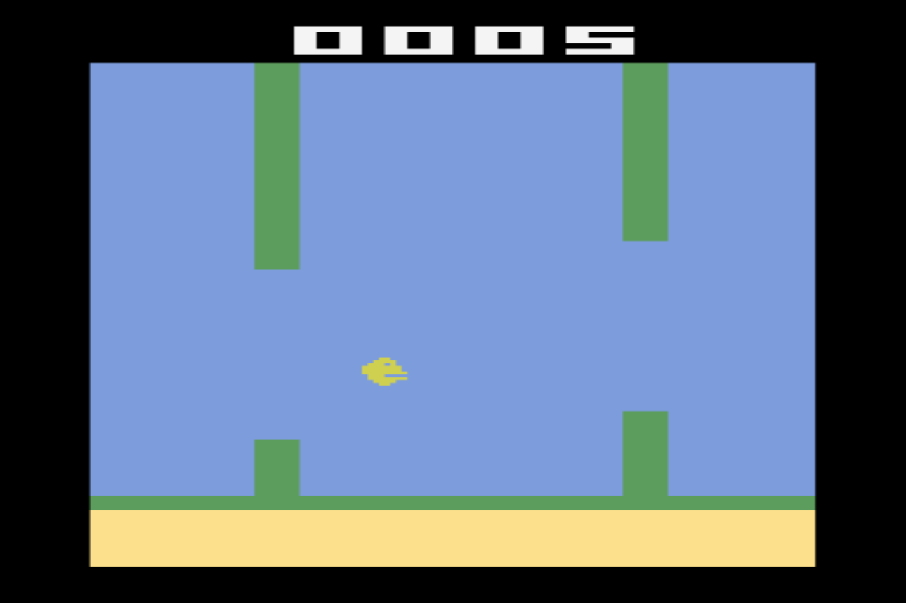

# Flappy Bird Atari 2600

Flappy Bird game for Atari 2600 console made with a purpose of learning assembly language

---

## Specifications

- TV format: NTSC
- Assembler: DASM

## Build requirements

- DASM
- Make (to be able to use the included Makefile)

## Controls
- Controller button - start; jump
- Reset - restart when game over

---

